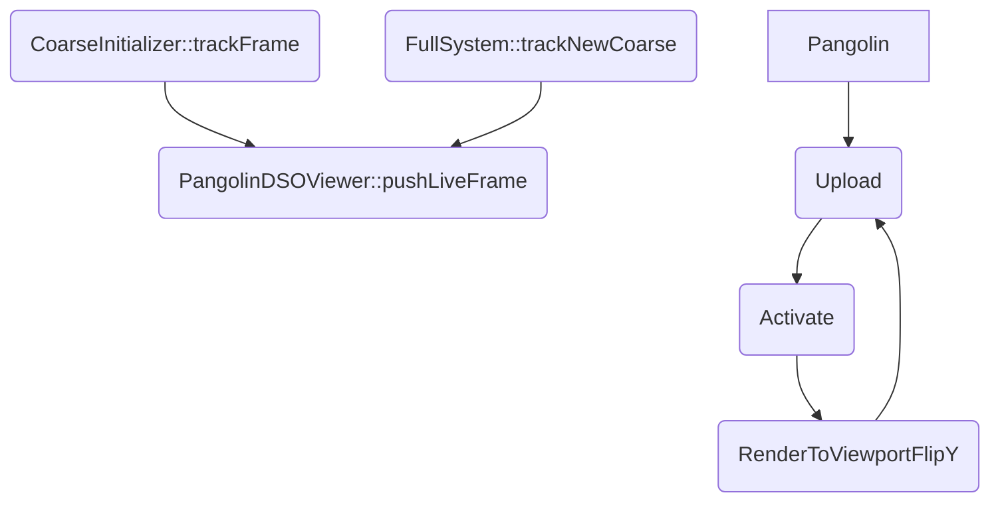

# Deep-dm-vio开发日志

## 待探索的方向

### 1. 直接法的回环检测

参考LDSO


## 0.工具
### markdown

各种流程图画法: https://www.runoob.com/markdown/md-advance.html

### 精度评估工具

https://github.com/lukasvst/dm-vio-python-tools.git

**evo**

原版ape: `evo_ape tum ~/datasets/V2_03_difficult/mav0/state_groundtruth_estimate0/data.tum results/dmvioresult-euroc-2022-04-08--17-24-27/mav_V2_03_difficult_0/result.txt -p -a -v`

APE w.r.t. translation part (m)
(with SE(3) Umeyama alignment)

       max      2.182458
      mean      1.030545
    median      1.039956
       min      0.066733
      rmse      1.128707
       sse      2239.657025
       std      0.460388


## 1.可视化
### Pangolin
https://stevenlovegrove.github.io/Pangolin/examples/

https://blog.csdn.net/weixin_43991178/article/details/105142470

**图像可视化**

缓存图像数据: `PangolinDSOViewer::pushLiveFrame(FrameHessian* image)`

写入数据: 

```cpp
if (videoImgChanged)
                texVideo.Upload(internalVideoImg->data, GL_BGR, GL_UNSIGNED_BYTE);
if (kfImgChanged)
                texKFDepth.Upload(internalKFImg->data, GL_BGR, GL_UNSIGNED_BYTE);
if (resImgChanged)
                texResidual.Upload(internalResImg->data, GL_BGR, GL_UNSIGNED_BYTE);
```

更新窗口:

```cpp
if (setting_render_displayVideo) {
                d_video.Activate();
                glColor4f(1.0f, 1.0f, 1.0f, 1.0f);
                texVideo.RenderToViewportFlipY();// 需要反转Y轴，否则输出是倒着的
            }

            if (setting_render_displayDepth) {
                d_kfDepth.Activate();
                glColor4f(1.0f, 1.0f, 1.0f, 1.0f);
                texKFDepth.RenderToViewportFlipY();// 需要反转Y轴，否则输出是倒着的
            }

            if (setting_render_displayResidual) {
                d_residual.Activate();
                glColor4f(1.0f, 1.0f, 1.0f, 1.0f);
                texResidual.RenderToViewportFlipY();// 需要反转Y轴，否则输出是倒着的
            }
```




```flow
st=>start: 开始
e=>end: 登录
io1=>inputoutput: 输入用户名密码
sub1=>subroutine: 数据库查询子类
cond=>condition: 是否有此用户
cond2=>condition: 密码是否正确
op=>operation: 读入用户信息
trackFrame=>operation: CoarseInitializer::trackFrame|current
trackNewCoarse=>operation: FullSystem::trackNewCoarse|current
pushLiveFrame=>operation: PangolinDSOViewer::pushLiveFrame|current

st->trackNewCoarse->pushLiveFrame->e
trackFrame->pushLiveFrame
```


```flow
st=>start: 开始
e=>end: 登录
io1=>inputoutput: 输入用户名密码
sub1=>subroutine: 数据库查询子类
cond=>condition: 是否有此用户
cond2=>condition: 密码是否正确
op=>operation: 读入用户信息
st->io1->sub1->cond
cond(yes,right)->cond2
cond(no)->io1(right)
cond2(yes,right)->op->e
cond2(no)->io1
```

```flow
st=>start: Start|past:>http://www.google.com[blank]
e=>end: End:>http://www.google.com
op1=>operation: get_hotel_ids|past
op2=>operation: get_proxy|current
sub1=>subroutine: get_proxy|current
op3=>operation: save_comment|current
op4=>operation: set_sentiment|current
op5=>operation: set_record|current

cond1=>condition: ids_remain空?
cond2=>condition: proxy_list空?
cond3=>condition: ids_got空?
cond4=>condition: 爬取成功??
cond5=>condition: ids_remain空?

io1=>inputoutput: ids-remain
io2=>inputoutput: proxy_list
io3=>inputoutput: ids-got

st->op1(right)->io1->cond1
cond1(yes)->sub1->io2->cond2
cond2(no)->op3
cond2(yes)->sub1
cond1(no)->op3->cond4
cond4(yes)->io3->cond3
cond4(no)->io1
cond3(no)->op4
cond3(yes, right)->cond5
cond5(yes)->op5
cond5(no)->cond3
op5->e
```

## 2.点提取

### 如何选取待跟踪的点?

- 依据feature map的梯度?
  - 结合原图像完成?
- 依据uncertainty map?

**PixLoc: **不需要选点,是已知3D点,因此可以直接用学出来coarse feature map进行矫正;

**思路1:20220412**


## 3.优化

### 3.1.代价函数

#### 可能存在的问题

**1) feature map的fine层似乎会存在较多噪声**

金字塔粗到精能解决吗

**2) feature map 似乎也会存在部分亮度变化**

对结果有影响吗?

能通过在训练中改善吗?


## 20220412

### 直接替换原图为feature map精度变差,跟踪存在丢失(对快速抖动不稳定)

深度估计错误,然后就跟踪失败


**可能原因:**

- [ ] 使用feature map依据梯度进行的特征点提取不合适?
- [ ] 仅依据feature_fine来构建金字塔进行跟踪不合理,应该使用pixloc方法,利用学习出来的不同层的feature map来进行多层金字塔跟踪
- [ ] 还没有取消光照参数

**解决办法:**

- 原图+feature map
  - 还是利用原图来进行特征提取,能量函数使用feature map来进行计算(pixloc)
  - 结合多层来进行粗到精跟踪
  - 先测试以下可行性?
    - 后续问题是:若可行如何取缔利用原图进行的特征提取
